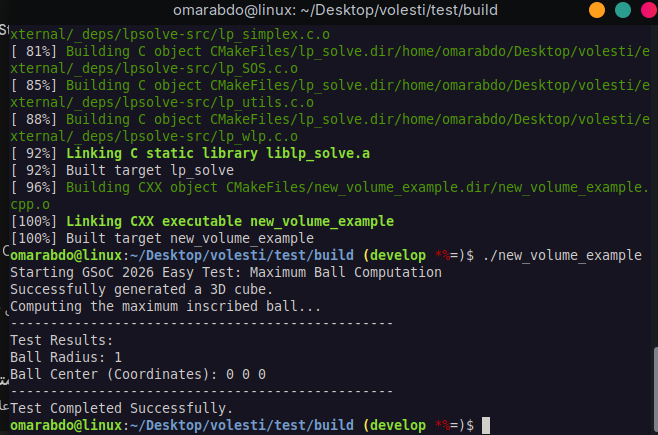

# GSoC 2026 - GeomScale Tests
**Project:** Exclude Lpsolve
**Applicant:** Omar Abdo

## Easy Test
**Task:** Built and run the R and C++ interfaces of volesti. Compute the maximum ball of a polytope using the existing functions.

**Result:**
I successfully built the C++ interface, generated a 3D H-polytope (cube), and computed the maximum inscribed ball (Chebyshev ball) utilizing the `ComputeInnerBall()` function.

- **Source Code:** [easy_test.cpp](EasyTest/easy_test.cpp)
- **Output Screenshot:** 
